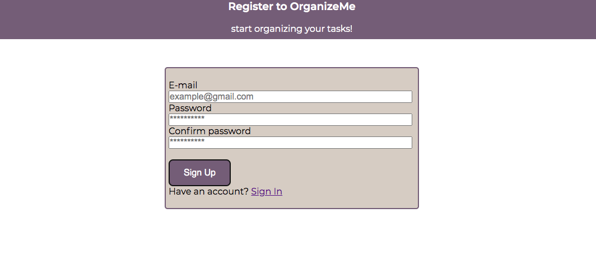

<!-- Structure -->
<!-- *** I am using markdown "reference" style links for readability.
*** Reference links are enclosed in brackets [ ] instead of parentheses ( ).
*** See the bottom of this document for the declaration of reference variables
*** https://www.markdownguide.org/basic-syntax/#reference-style-links -->

<!-- "back to top" -->

<!-- PROJECT LOGO -->
 

   
  <h3 align="center">Task App</h3>
  <a href="https://ironhackfinal.vercel.app">Visit Website</a> 

<!-- TABLE OF CONTENTS -->

  
Table of Contents

  <ol>
    <li>
      <a href="#about-the-project">About the Project</a>
      <ul>
        <li><a href="#built-with">Built With </a></li>
      </ul>
    </li>
    <li>
    <a href="#roadmap">Roadmap</a>
     <ul>
     <li><a href="#backlog">Back log</a></li>
        <li><a href="#day-one">Tuesday 07, February 2023</a></li>
        <li><a href="#day-two">Wednesday  08, February 2023</a></li>
        <li><a href="#day-three">Thursday 09, February 2023</a></li>
        <li><a href="#day-four">Friday 10, February 2023</a></li>
        <li><a href="#day-five">Monday 13, February 2023</a></li>
        <li><a href="#day-six">Tuesday 14, February 2023</a></li>
        <li><a href="#day-seven">Wednesday 15, February 2023</a></li>
        <li><a href="#day-eight">Thursday 16, February 2023</a></li>
        <li><a href="#day-nine">Friday 17, February 2023</a></li>
        <li><a href="#day-ten">Monday 20, February 2023</a></li>
        <li><a href="#day-eleven">Tuesday 21, February 2023</a></li>
        <li><a href="#day-twelve">Wednesday 22, February 2023</a></li>
        <li><a href="#day-thirteen">Thursday 23, February 2023</a></li>
        <li><a href="#day-fourteen">Friday 24, February 2023</a></li>
      </ul>
    </li>
    <li><a href="#about">About</a></li>
    <li><a href="#acknowledgment">Acknowledgment</a></li>
    <li><a href="#technical-challenge">Technical Challenge</a></li>
    <li><a href="#big-mistake">Big Mistake</a></li>
    <li><a href="#cheat-sheet">Cheat Sheet</a></li>
  </ol>

<!-- ABOUT THE PROJECT -->

## About the Project

<!-- Como parte del midterm de este bootcamp se nos asignó un proyecto titulado Circle Agency. El objetivo del mismo fue diseñar una página web para una compañía ficticia de diseño web que tuviera tres aspectos principales; la página debía ser "responsive" usando HTML, CSS y JavaScript con diferentes propiedades de diseño como Flexbox y Grid. Además era necesario utilizar Vercel para lanzar la página en vivo. Un reto extra del quer hablaremos más adelante fue el uso de GitHub para poder trabajar en pareja sobre un mismo documento.

La estructura del proyecto se basó en tres páginas; una landing page, una página de proyectos y una página de Contact Us. En la landing page se muestra información general de Circle Agency. En la sección de projects se destacan los proyectos de la empresa y en el Contact Us se creó un formulario de contactos para que los usuarios se comuniquen con la empresa.

Dicho esto, la pagina debía tener funcionalidades creadas con JavaScript. Entre ellas, hacer un fetch de una API para mostrar información en la sección de projects. Esto debía hacerse modificando el DOM. Otra funcionalidad fue la del formulario de Contact Us que permite a los usuarios enviar su información al API al igual que mostrar una alerta en caso de poder haber enviado correctamente o no la misma.

Este proyecto se hizo en pareja y las tareas se dividieron a medida que ibamos avanzando. Muchos aspectos del trabajo se hicieron en conjunto con el deseo de aprender de las fortalezas de cada una en diferentes aspectos de lo que conocemos sobre codificar.

A lo largo del proyecto utilizamos enlaces como recursos para finalizarlo exitosamente:
     
<a href="https://youtu.be/flItyHiDm7E">Hamburger Button</a>

     
<a href="https://jsonplaceholder.typicode.com/posts">API</a>

     
<a href="https://getbutterfly.com/fast-and-accessible-css-only-client-logo-carousel/">Slider</a>

     
<a href="https://cssgrid-generator.netlify.app/">Grid Generator</a>

     
<a href="https://fonts.googleapis.com/css2?family=Roboto:wght@300;400;500;900&display=swap">Google Font Libraries</a>
 -->

(<a href="#readme-top">back to top</a>)

Resources:

()Hamburger Menu

()Hover Buttons

### Built With

<!-- Este proyecto se construyó con HTML, CSS y JavaScript. Para lanzar el proyecto a la web utilizamos Vercel y para temas de estructura organizativa y seguridad en cuanto al progreso se utilizó GitHub con multi-branching, ya que estuvimos trabajando en pareja. Asegurando que todas las versiones del proyecto no fueran afectadas de forma negativa y todo se guardara exitosamente. -->

(<a href="#readme-top">back to top</a>)

## Roadmap

#### Backlog

- [ ] README update
- [ ] Clean Code
- [ ] Delete/Cancel Emit Option Task
- [ ] Update task: Investigate if particular aspects of a task can be individually updated.

#### Day One

###### Tuesday 07, February 2023

- [x] Create the repository
- [x] Import repository to GitHub
- [x] Link Supabase correctly
- [x] Read & review boilerplate
- [x] Begin README structure

#### Day Two

###### Wednesday 08, February 2023

- [x] Supabase profile table \* needs columns
- [x] Sign up
- [x] Sign in
- [x] Sign out
- [x] Sign out

#### Day Three

###### Thursday 09, February 2023

- [x] Create Task
- [x] Read Task
- [ ] Update Task
- [x] Delete Task

#### Day Four

###### Friday 10, February 2023

- [x] Update Task
- [x] Review Delete Task
- [x] Completed Task

#### Day Five

###### Monday 13, February 2023

- [x] Profiles table in SUPABASE
- [x] Add "status" button functionality to tasks
- [x] Begin CSS

#### Day Six

###### Tuesday 14, February 2023

- [x] CSS Buttons

#### Day Seven

###### Wednesday 15, February 2023

#### Day Eight

###### Thursday 16, February 2023

#### Day Nine

###### Friday 17, February 2023

#### Day Ten

###### Monday 20, February 2023

- [ ] Continue with everything CSS

#### Day Eleven

###### Tuesday 21, February 2023

- [ ] Finish CSS for tasks

#### Day Twelve

###### Wednesday 22, February 2023

- [x] CSS for homepage
- [x] CSS for task tables
- [x] Hamburger Button

#### Day Thirteen

###### Thursday 23, February 2023

- [ ] Final tweeks NAV CSS
- [ ] Final tweeks Hamburger Button
- [ ] Finish README
- [ ] Prepare Presentation

#### Day Fourteen

###### Friday 24, February 2023

- [ ] Presentation

(<a href="#readme-top">back to top</a>)

<!-- Acerca de mi -->

## About

<!--
Como ya hemos mencionado, este proyecto se realizó en pareja por Laura Isabel Anguita e Ikerne Sanz. Para ambas es la primera vez que nos exponemos al mundo de la programación Front-End, aunque sí estuvimos trabajando por tres años, en una empresa dedicada a AI haciendo Language Data Analysis. -->

<!--
Ikerne - [https://www.linkedin.com/in/ikernesg/](https://www.linkedin.com/in/ikernesg/) - ikernesanz@gmail.com

Project Links: [https://midterm-ironhack-4d5i2r2pt-ikerne.vercel.app/](https://midterm-ironhack-4d5i2r2pt-ikerne.vercel.app/)
              & [https://github.com/Ikerne/midterm-ironhack](https://github.com/Ikerne/midterm-ironhack)

Presentation Link: [https://docs.google.com/presentation/d/1ALLf1G-I5kGCl5IGPHk-GV33y0MsDX1cV2_IcLf5C8I/edit#slide=id.p](https://docs.google.com/presentation/d/1ALLf1G-I5kGCl5IGPHk-GV33y0MsDX1cV2_IcLf5C8I/edit#slide=id.p) -->

(<a href="#readme-top">back to top</a>)

<!-- ACKNOWLEDGMENTS -->

## Acknowledgment

<!-- Queremos agradecer a los tres profesores de este bootcamp en Ironhack; Diego Zito, Jarko Garrido y Aleix Abuli. Gracias por su tiempo, toda la información brindada, su paciencia y las horas extra para ayudarnos a solventar todo tipo de dudas. También, al SOC por facilitarnos este curso de modo que podamos seguir formándonos profesionalmente.  -->

(<a href="#readme-top">back to top</a>)

## Technical Challenge

<!-- – El primer reto que nos encontramos fue poder trabajar exitosamente con diferentes branches dentro de GitHub.

– El segundo reto ha sido la parte de JavaScript en la sección de Projects y Contact Us. Al ser la primera vez que nos enfrentamos a este lenguaje en temas de proyecto.

– El nivel de proyecto es muy completo y extenso. Por lo que nos tomó tiempo saber cómo organizarnos para cumplir con todos los objetivos que el proyecto conlleva.  -->

(<a href="#readme-top">back to top</a>)

## Big Mistake

<!-- Nuestros errores más grandes se dieron en nuestros commits a GitHub cuando había que hacer merge de las tres ramas. Se nos borraron avances en varias ocasiones y perdimos horas de trabajo tratando de solucionar este problema todos los días. No obstante, nos organizamos para trabajar en diferentes secciones del proyecto y evitar conflictos y solaparnos a la hora de hacer merge. Luego, con la ayuda de los profesores aprendimos a hacer copias de seguridad antes de los commits y merges para no perder nuestro progreso.

Una lección que nos llevamos es que no está mal "aim high", siempre y cuando reconozcamos las limitaciones de tiempo y sea manejable el nivel del estrés del equipo. Ciertamente, nos descatacamos por lo que significa "team work makes the dream work", pero hubo momentos donde nos teníamos que recordar dónde estamos y qué debemos priorizar mantieniendo el objetivo final siempre en mente.  -->

(<a href="#readme-top">back to top</a>)

<!-- Cheat Sheet -->

## Cheat Sheet

<!--Check git satus-->

git status

<!--Shortcut to add changes to GitHub-->

git add . && git commit -m " " && git push origin master

<!--Launch host app-->

npm run dev

(<a href="#readme-top">back to top</a>)

